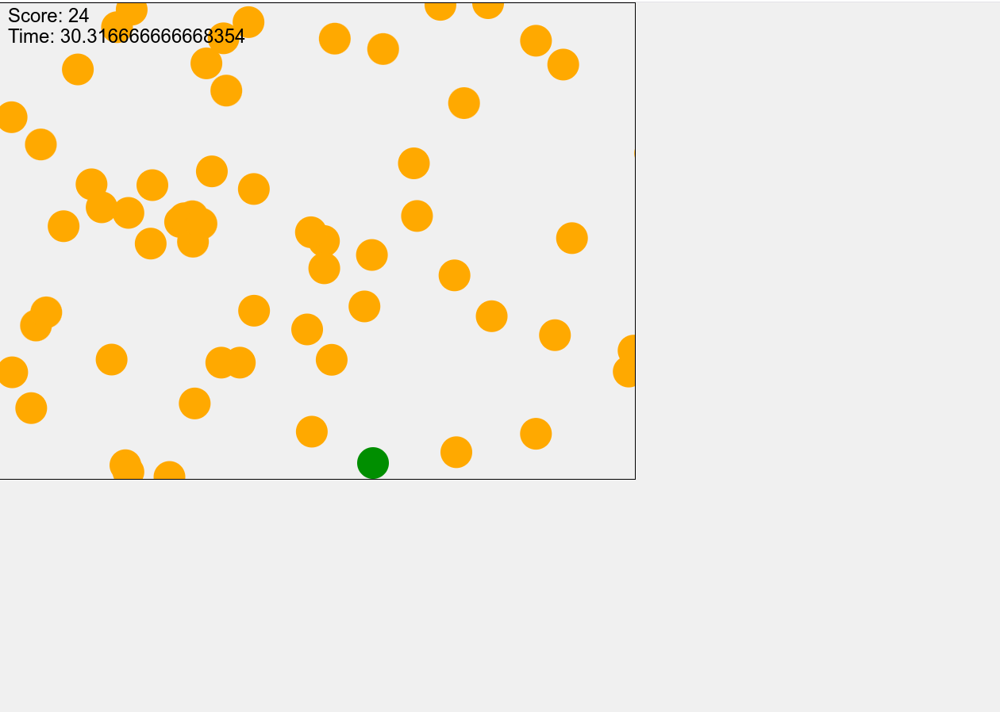
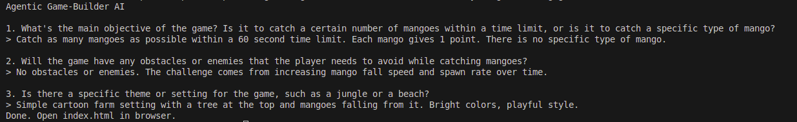

---

# Agentic Game-Builder AI

A agentic system that converts ambiguous natural-language game ideas into a runnable browser game using HTML, CSS, and JavaScript.

The goal of this project is to demonstrate structured AI control flow — not prompt engineering.

---

# Objective

The agent:

1. Accepts an ambiguous natural-language game idea
2. Asks clarifying questions
3. Generates a structured internal plan (JSON)
4. Produces a playable browser game
5. Outputs runnable files:

   * `index.html`
   * `style.css`
   * `game.js`

The output game runs locally by simply opening `index.html` in a browser.

---

# Agent Architecture

The system is built as a **multi-phase orchestrated agent**, not a single prompt.

## Phase 1 — Requirements Clarification

* LLM generates 2–5 targeted clarification questions.
* Questions focus on:

  * Controls
  * Win/Lose conditions
  * Mechanics
  * Style
* Conversation state is stored.
* Agent proceeds only after requirements are sufficiently clear.

---

## Phase 2 — Planning

The agent generates a structured JSON plan containing:

* Framework choice (`vanilla` or `phaser`)
* Game mechanics
* Controls
* State definitions
* Game loop description
* Required output files
* Acceptance checks

This plan is saved as `plan.json` for transparency.

This separates reasoning from execution.

---

## Phase 3 — Execution

* Agent generates exactly three files in strict format:

  * `index.html`
  * `style.css`
  * `game.js`
* Output is validated.
* If format is invalid → automatic retry.
* Files are written to `/output`.

The generated game:

* Requires no build step
* Uses no external assets
* Runs locally in a browser

---

# Project Structure

```
agentic-game-builder/
│
├── main.py
├── Dockerfile
├── requirements.txt
├── README.md
│
└── agent/
    ├── llm.py
    ├── prompts.py
    └── orchestrator.py
```

---

# Running the Agent

## 🔹 Docker Build

```bash
docker build -t agentic-game-builder .
```

---

## Docker Run (Groq Example)

```bash
docker run -it --rm \
  -e LLM_PROVIDER=groq \
  -e GROQ_API_KEY=YOUR_KEY \
  -e OPENAI_MODEL=llama-3.1-8b-instant \
  -v "$(pwd)/output:/output" \
  agentic-game-builder \
  "Make a small funny mango catching game"
```

---

## Output

After clarification and generation:

```
output/
 ├── index.html
 ├── style.css
 ├── game.js
 └── plan.json
```

Open:

```
output/index.html
```

in your browser.

---

# 🎮 Example Interaction

### Input:

```
Make a small funny mango catching game.
```

### Clarification Phase:

Agent asks:

* What is the main objective?
* Are there obstacles?
* Any power-ups?
* What style?

User answers:

* 60 second timer
* 1 point per mango
* Lose after missing 10
* No power-ups
* Cartoonish style

---

### Planning Phase (Excerpt from plan.json)

```json
{
  "framework": "vanilla",
  "mechanics": ["Falling mangoes", "Basket movement", "Score tracking"],
  "controls": ["Left/Right arrow keys"],
  "states": ["start", "playing", "gameOver"],
  "game_loop": "Spawn mangoes, update positions, detect collisions"
}
```

---

### Execution Phase

Generates:

* Canvas-based game
* Moving basket
* Falling mangoes
* Timer
* Score display
* Game over screen

Runs locally without any build tools.

---

# Trade-offs

* No runtime JS execution validation (could add Playwright)
* Minimal structural validation only
* Uses LLM for code generation (no template hardcoding)
* Interactive clarification only (no API-driven multi-turn mode yet)

---

# Improvements With More Time

* Add headless browser validation (auto-check for runtime errors)
* Add multi-attempt repair loop with diffing
* Add non-interactive JSON input mode
* Add unit tests for file validation
* Add agent memory persistence
* Add cost/token tracking

---

# Design Decisions

* Strict phase separation (Clarify → Plan → Build)
* Enforced structured output
* Minimal but functional architecture
* Docker-first design for reproducibility
* Provider-agnostic LLM integration (Groq / OpenAI)

---

# LLM Provider Support

Supports:

* Groq (OpenAI-compatible endpoint)
* OpenAI

Switch provider using:

```
LLM_PROVIDER=groq
```

---

# Additional Test Ideas

You can test with:

```
Make a fast-paced spaceship dodging game.
Make a reaction clicker game.
Make a simple jumping runner game.
Make a memory matching card game.
```

The agent will always:

1. Clarify
2. Plan
3. Build

---


# Sample Generated Game

Below is an example of a generated mango-catching game:



